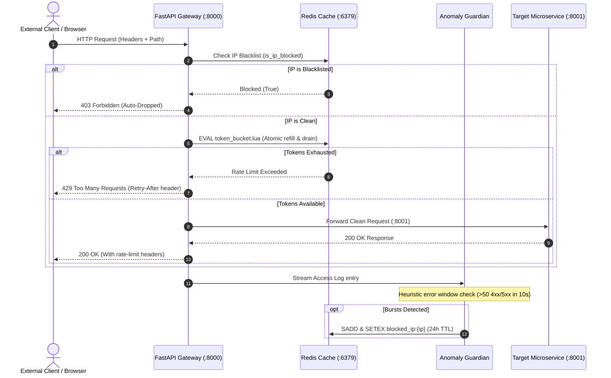

# 🛡️ ShieldAPI

<div align="center">


### **Next-Gen Microservice Security Gateway, Distributed Token Bucket Rate Limiter & Heuristic Anomaly Guardian**

[](https://fastapi.tiangolo.com/)
[](https://www.python.org/)
[](https://redis.io/)
[](https://react.dev/)
[](https://www.typescriptlang.org/)
[](https://tailwindcss.com/)
[](https://www.docker.com/)
[](LICENSE)
[](https://www.oracle.com/cloud/free/)

[**Live Demo (DuckDNS)**](https://shield-gateway.duckdns.org:3000/) • [**Swagger API Docs**](http://shield-gateway.duckdns.org:8000/docs) • [**Architecture Specs**](./architecture_diagrams.md)

</div>

---

## 📖 Overview

**ShieldAPI** is a high-performance, enterprise-grade API Security Gateway and Threat Mitigation suite. Acting as a protective reverse proxy in front of internal backend services, ShieldAPI filters out malicious traffic, enforces atomic token-bucket rate limits per client IP or API key, continuously analyzes access logs via an asynchronous anomaly engine, and auto-blacklists hostile actors in Redis with automatic TTL expiration.

The platform comes equipped with a **futuristic cyber-styled Command Center** built with React, Vite, and Tailwind CSS, featuring real-time telemetry, live RPM traffic charts, credential management, and interactive rate limit testing controls.

---

## 📸 Visual Showcase

### 1. Command Center & Telemetry Overview
Real-time RPM throughput, latency monitoring (< 0.8ms Redis lookups), success rates, and live request distribution.
<div align="center">
  
</div>

<br/>

### 2. Distributed Token Bucket Rate Limiting
Interactive token refill controls (`1 Req`, `Burst 5`, `Flood 12`), live token capacity gauge, and atomic Redis Lua evaluation stats.
<div align="center">
  
</div>

<br/>

### 3. Anomaly Guardian & Threat Mitigation
Heuristic error burst detector, threat simulation buttons (`Simulate 404 Burst`, `Manual IP Ban`), and active Redis blacklist table with 24-hour TTL expiration.
<div align="center">
  
</div>

<br/>

### 4. API Keys Credential Vault
Client access tiers (Enterprise, Standard), token identifiers, usage volume, sub-millisecond Redis auth checks, and key rotation/revocation.
<div align="center">
  
</div>

<br/>

### 5. Real-Time Access Logs & Audit Trail
Live HTTP access log stream detailing method badges (`GET`, `POST`, `PUT`), status codes (`200 ALLOWED`, `429 THROTTLED`, `403 FORBIDDEN`), latency timings, and origin IP mappings.
<div align="center">
  
</div>

---

## ✨ Key Features

- **⚡ Atomic Lua Token Bucket**: Zero race-condition rate limiting executed natively inside Redis via `token_bucket.lua`. Supports dual-key rate limiting (Client IP + API Key) with automatic key expiration to eliminate memory leaks.
- **🛡️ Asynchronous Anomaly Guardian**: Independent Pipes & Filters engine that watches gateway access logs in real-time. Detects suspicious error bursts (e.g. >50 404s/500s in 10s) and automatically writes temporary bans to Redis.
- **🔑 Sub-Millisecond Authentication**: High-speed API key validation (<0.6ms) with instantaneous revocation and tier quotas.
- **🎯 Reverse Proxy & Route Shielding**: Transparently proxies valid requests to protected internal microservices (`/proxy/*`) while dropping throttled or banned requests immediately at the edge.
- **📊 Cyberpunk Command Center UI**: Modern dark-mode React 18 interface with simulated traffic generators, live metrics graphs, and token test triggers.
- **🐳 Monorepo Multi-Container Orchestration**: Production-ready `docker-compose.yml` linking Redis, the FastAPI Gateway, the Anomaly Engine, a mock downstream Backend service, and the Dashboard UI.

---

## 🏗️ Monorepo Architecture

```
shieldApi/
├── assets/                       # High-resolution dashboard showcase screenshots
├── apps/
│   ├── gateway/                  # FastAPI Micro-Kernel Reverse Proxy & Plugins
│   │   ├── api/                  # Routes, auth plugins, rate limiting handlers
│   │   ├── core/                 # Config & logging middleware
│   │   └── Dockerfile
│   ├── anomaly-engine/           # Background Python daemon (Pipes & Filters log analyzer)
│   │   ├── engine/               # Watchdog log listener, parser, detector, blocker
│   │   └── Dockerfile
│   ├── dashboard/                # React 18 / TypeScript / Vite / Tailwind UI
│   │   ├── src/                  # Command Center components, charts, and telemetry
│   │   └── Dockerfile
│   └── backend-service/          # Protected internal microservice (Target destination)
│       └── Dockerfile
├── packages/
│   └── shared/                   # Shared Redis bridge & Lua scripts
│       ├── redis_manager.py      # Unified Redis client interface
│       └── token_bucket.lua      # Atomic Lua script for token refill & deduction
├── architecture_diagrams.md      # UML component & sequence specifications
├── docker-compose.yml            # Multi-service orchestration
└── handover_context.md           # Engineering notes & module specifications
```

---

## 🔄 Request Lifecycle & Data Flow



---

## 🚀 Quick Start (Local Docker Compose)

### Prerequisites
* [Docker Desktop](https://www.docker.com/products/docker-desktop/) (Docker Engine 20.10+ and Docker Compose v2+)
* [Git](https://git-scm.com/)

### 1. Clone the Repository
```bash
git clone https://github.com/Anshu666666/shieldApi.git
cd shieldApi
```

### 2. Launch All Services
```bash
docker-compose up --build -d
```

### 3. Verify Container Health
```bash
docker-compose ps
```

| Container Name | Port Binding | Purpose |
| :--- | :--- | :--- |
| **`shieldapi-dashboard`** | `http://localhost:3000` | Admin Command Center UI |
| **`shieldapi-gateway`** | `http://localhost:8000` | Core API Gateway & Proxy |
| **`shieldapi-backend-service`** | `http://localhost:8001` | Mock Upstream Backend Service |
| **`shieldapi-redis`** | `localhost:6379` | In-Memory Token Bucket & Blacklist |
| **`shieldapi-anomaly-engine`** | *Internal daemon* | Background Log Analysis |

---

## 🧪 Testing & Verification

### 1. Send Requests Through the Gateway
```bash
# Make a request to the protected backend through the gateway
curl -i http://localhost:8000/proxy/data
```

### 2. Test Rate Limiter (Exhaust Token Bucket)
Send rapid requests to trigger the token bucket threshold:
```bash
for i in {1..15}; do curl -s -o /dev/null -w "%{http_code}\n" http://localhost:8000/proxy/data; done
# Output will transition from 200 to 429 Too Many Requests
```

### 3. Run Automated Integration Tests
```bash
# Run unit and integration verification for Redis & Token Bucket
python test_redis_manager.py
python test_e2e_integration.py
```

---

## 🌐 Production Deployment (Oracle Cloud + DuckDNS)

ShieldAPI is architected to run seamlessly on an **Oracle Cloud Infrastructure (OCI) Always Free** compute instance with dynamic DNS:

1. **Provision VM**: Launch an Ubuntu 22.04 / 24.04 instance on Oracle Cloud.
2. **Configure Security Lists (VCN Ingress Rules)**:
   * Allow TCP Port `3000` (Dashboard)
   * Allow TCP Port `8000` (Gateway Proxy)
3. **Open Ubuntu Firewall**:
   ```bash
   sudo iptables -I INPUT 6 -m state --state NEW -p tcp --dport 3000 -j ACCEPT
   sudo iptables -I INPUT 6 -m state --state NEW -p tcp --dport 8000 -j ACCEPT
   sudo netfilter-persistent save
   ```
4. **Point Dynamic Domain (DuckDNS)**:
   Point your DuckDNS domain (e.g. `shield-gateway.duckdns.org`) to your Oracle VM public IP address.
5. **Run Stack**:
   ```bash
   git clone https://github.com/Anshu666666/shieldApi.git
   cd shieldApi
   docker compose up -d --build
   ```

---

## ⚙️ Environment Variables

| Variable | Default Value | Description |
| :--- | :--- | :--- |
| `REDIS_HOST` | `redis` | Hostname or IP of the Redis server |
| `REDIS_PORT` | `6379` | Port for the Redis connection |
| `BACKEND_SERVICE_URL` | `http://backend-service:8001` | Upstream target service to proxy requests to |
| `LOG_FILE_PATH` | `/var/log/shieldapi/access.log` | Shared volume path for gateway access logs |
| `DEFAULT_TOKEN_CAPACITY`| `10` | Default burst token allowance per client bucket |
| `DEFAULT_REFILL_RATE` | `2` | Tokens refilled per second |
| `ANOMALY_ERROR_THRESHOLD`| `50` | Number of 4xx/5xx errors in window to trigger block |
| `ANOMALY_WINDOW_SECONDS`| `10` | Sliding window duration for anomaly detector |
| `BLOCK_TTL_SECONDS` | `86400` | Duration of IP ban in Redis (24 hours) |

---

## 📄 License

Distributed under the **MIT License**. See [`LICENSE`](LICENSE) for more information.
