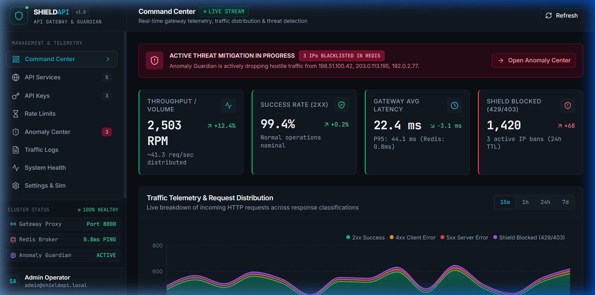
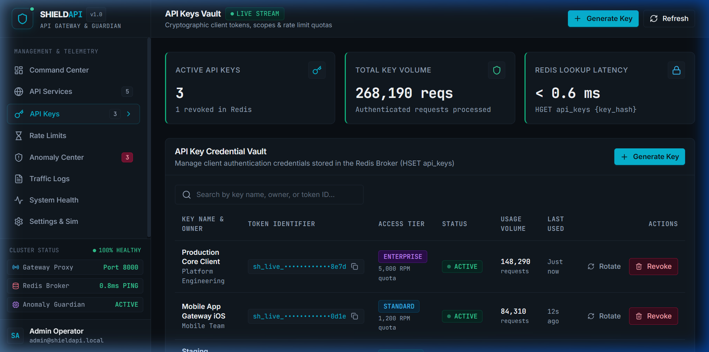
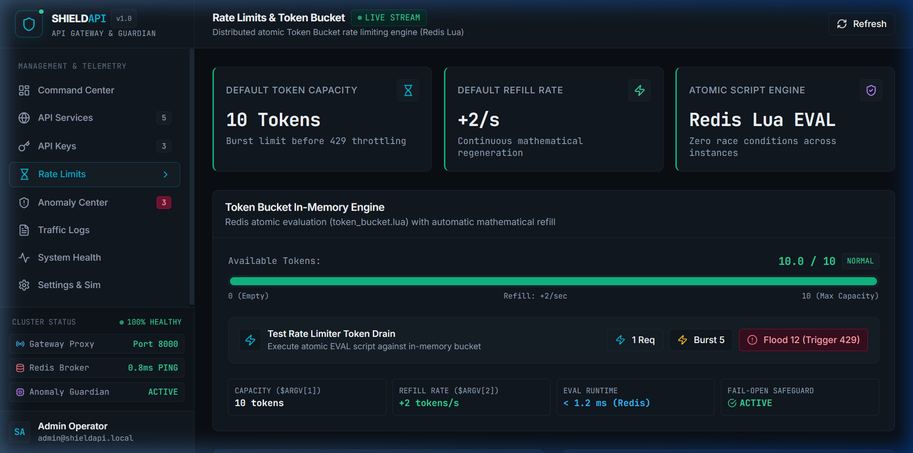
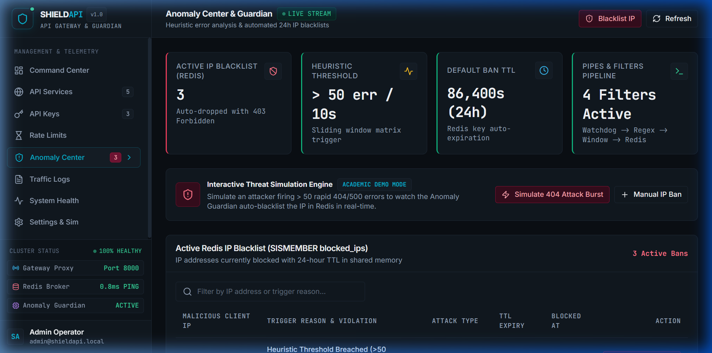
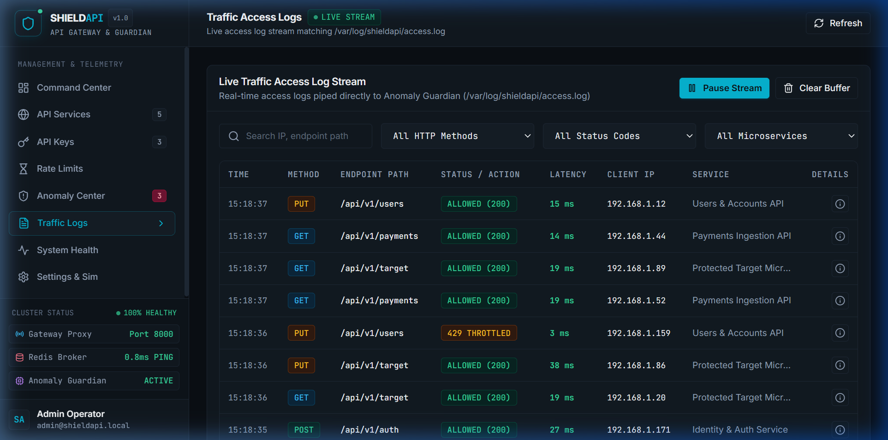

# ShieldAPI — System User Manual & Operational Guide

<div align="center">

# 🛡️ ShieldAPI
### Distributed Microservice Security Gateway, Atomic Token-Bucket Rate Limiter & Heuristic Anomaly Guardian

---

**Course / Project Submission: User Manual**

| Team Member Name | Roll Number |
| :--- | :--- |
| **Aman Madheshiya** | **2024BCD0032** |
| **Anshuman Biswas** | **2024BCD0008** |
| **Syed Zaid Gafer** | **2024BCD0028** |
| **Nipun Abhilash** | **2024BCD0024** |

<br/>

**Date of Submission:** September 2026  
**Document Version:** 1.0.0 (Release)  
**Live Application URL:** [https://shield-gateway.duckdns.org:3000](https://shield-gateway.duckdns.org:3000)  
**FastAPI Gateway Swagger Documentation:** [http://shield-gateway.duckdns.org:8000/docs](http://shield-gateway.duckdns.org:8000/docs)  
**GitHub Repository:** [https://github.com/Anshu666666/shieldApi](https://github.com/Anshu666666/shieldApi)

---

</div>

<div style="page-break-after: always;"></div>

## Table of Contents

1. [Introduction](#1-introduction)
   - 1.1 [Product Overview](#11-product-overview)
   - 1.2 [Purpose and Problem Statement](#12-purpose-and-problem-statement)
   - 1.3 [Intended Audience & Personas](#13-intended-audience--personas)
2. [System Requirements](#2-system-requirements)
   - 2.1 [Hardware Specifications](#21-hardware-specifications)
   - 2.2 [Software Prerequisites](#22-software-prerequisites)
   - 2.3 [Network & Firewall Requirements](#23-network--firewall-requirements)
   - 2.4 [Supported Client Browsers & Platforms](#24-supported-client-browsers--platforms)
3. [Installation & Setup Guide](#3-installation--setup-guide)
   - 3.1 [Cloud Access (Instant Zero-Installation)](#31-cloud-access-instant-zero-installation)
   - 3.2 [Local Installation via Docker Compose](#32-local-installation-via-docker-compose)
   - 3.3 [Verifying Container Health](#33-verifying-container-health)
4. [User Access & Authentication (Setup / Credentials)](#4-user-access--authentication-setup--credentials)
   - 4.1 [Admin Command Center Access](#41-admin-command-center-access)
   - 4.2 [Client API Key Generation & Management](#42-client-api-key-generation--management)
   - 4.3 [Dual-Tier Authentication Logic](#43-dual-tier-authentication-logic)
5. [System Features & Operational Walkthrough](#5-system-features--operational-walkthrough)
   - 5.1 [Command Center & Real-Time Telemetry](#51-command-center--real-time-telemetry)
   - 5.2 [Distributed Token Bucket Rate Limiting](#52-distributed-token-bucket-rate-limiting)
   - 5.3 [Anomaly Guardian & Threat Mitigation Engine](#53-anomaly-guardian--threat-mitigation-engine)
   - 5.4 [API Key Vault & Quota Allocation](#54-api-key-vault--quota-allocation)
   - 5.5 [Traffic Access Logs & Real-Time Audit Trail](#55-traffic-access-logs--real-time-audit-trail)
   - 5.6 [Target Microservice Protection (`/proxy/*`)](#56-target-microservice-protection-proxy)
6. [Navigation & Interface Layout](#6-navigation--interface-layout)
   - 6.1 [Global Navigation Sidebar](#61-global-navigation-sidebar)
   - 6.2 [Status Bar & Cluster Connectivity](#62-status-bar--cluster-connectivity)
   - 6.3 [Mobile & Responsive Layout](#63-mobile--responsive-layout)
7. [Input & Expected Output Specifications](#7-input--expected-output-specifications)
   - 7.1 [Summary Matrix of System Interactions](#71-summary-matrix-of-system-interactions)
   - 7.2 [Detailed Request/Response Examples](#72-detailed-requestresponse-examples)
8. [Error Handling & Alert Codes](#8-error-handling--alert-codes)
   - 8.1 [HTTP 429 Too Many Requests](#81-http-429-too-many-requests)
   - 8.2 [HTTP 403 Forbidden (Blacklisted IP)](#82-http-403-forbidden-blacklisted-ip)
   - 8.3 [HTTP 401 Unauthorized (Invalid API Key)](#83-http-401-unauthorized-invalid-api-key)
   - 8.4 [SSL Protocol Handshake Errors](#84-ssl-protocol-handshake-errors)
   - 8.5 [HTTP 502 Bad Gateway](#85-http-502-bad-gateway)
9. [Safe Exit & System Teardown](#9-safe-exit--system-teardown)
   - 9.1 [Closing the Web Interface](#91-closing-the-web-interface)
   - 9.2 [Graceful Docker Teardown](#92-graceful-docker-teardown)
   - 9.3 [Data Persistence Retention](#93-data-persistence-retention)
10. [Troubleshooting & Frequently Asked Questions (FAQ)](#10-troubleshooting--frequently-asked-questions-faq)

---

<div style="page-break-after: always;"></div>

## 1. Introduction

### 1.1 Product Overview
**ShieldAPI** is an enterprise-grade, high-performance API Security Gateway and Threat Mitigation suite. Operating as a protective intelligent reverse proxy directly in front of internal backend microservices, ShieldAPI inspects all incoming HTTP traffic, enforces atomic distributed token-bucket rate limits per client IP or API key, continuously analyzes access logs via an asynchronous anomaly engine, and automatically blacklists malicious actors in Redis with automatic time-to-live (TTL) ban expiration.

The ecosystem is paired with a futuristic, cyber-themed **Admin Command Center** built with React 18, Vite, and Tailwind CSS. The Command Center visualizes real-time cluster telemetry, RPM throughput distributions, active threat blacklists, and interactive controls for rate limit testing and attack simulations.

```
+---------------------------------------------------------------------------------------+
|                                    ShieldAPI ECOSYSTEM                                |
|                                                                                       |
|   +-------------------+        +--------------------+        +--------------------+   |
|   |   External User   | =====> |  FastAPI Gateway   | =====> | Protected Backend  |   |
|   |  Browser / Client | <===== |    (:8000)         | <===== |   Service (:8001)  |   |
|   +-------------------+        +---------+----------+        +--------------------+   |
|                                          |                                            |
|                                +---------+----------+                                 |
|                                | Redis Memory Broker|                                 |
|                                |  (Atomic Lua EVAL) |                                 |
|                                +---------+----------+                                 |
|                                          ^                                            |
|                                          | Auto-Blacklist (24h TTL)                   |
|                                +---------+----------+                                 |
|                                |   Anomaly Guardian |                                 |
|                                |  (Pipes & Filters) | <--- Watches access.log         |
|                                +--------------------+                                 |
+---------------------------------------------------------------------------------------+
```

### 1.2 Purpose and Problem Statement
Modern microservice architectures are frequently subjected to distributed denial-of-service (DDoS) attacks, brute-force credential stuffing, malicious scrapers, and accidental traffic floods. Off-the-shelf cloud gateways often suffer from:
1. **High Latency Overhead**: Calling external managed databases for every rate check introduces 30ms–80ms network latency roundtrips.
2. **Race Conditions**: Naive rate limit implementations read and write token counts across separate network operations, failing under concurrent burst conditions.
3. **Reactive Log Auditing**: Security teams only discover attacks hours after damage occurs when reviewing archived logs.

**ShieldAPI solves these challenges by:**
* **Colocating an In-Memory Redis Broker**: Performing rate-limit checks in `< 0.5 ms` via atomic Redis Lua scripts (`token_bucket.lua`).
* **Active Threat Neutralization**: Employing an autonomous background Anomaly Guardian using the *Pipes & Filters* pattern to detect 4xx/5xx burst attacks within a 10-second sliding window and write temporary bans directly to Redis.
* **Unified Observability**: Supplying systems administrators with a zero-configuration web dashboard offering end-to-end visibility and real-time intervention controls.

### 1.3 Intended Audience & Personas
This manual is tailored for the following user groups:
* **System Administrators & SREs**: Managing gateway uptime, modifying rate-limit refill rules, and monitoring server health.
* **Security Analysts**: Reviewing anomaly alerts, inspecting auto-banned IP lists, and testing threat responses.
* **Backend Developers**: Integrating downstream APIs behind the ShieldAPI gateway proxy and managing client API keys.
* **Academic Evaluators**: Reviewing system architecture, functionality, operational workflows, and test demonstrations.

---

<div style="page-break-after: always;"></div>

## 2. System Requirements

### 2.1 Hardware Specifications

| Component | Minimum Specification (Host / VM) | Recommended Production Spec | Client Device (User) |
| :--- | :--- | :--- | :--- |
| **Processor** | 1 vCPU (x86_64 or ARM64) | 2 vCPUs or higher | Any modern Dual-Core CPU |
| **System Memory (RAM)** | 1.0 GB RAM | 4.0 GB RAM | 2.0 GB RAM |
| **Storage (Disk)** | 5.0 GB available SSD storage | 20.0 GB SSD storage | 500 MB temporary browser cache |
| **Network Bandwidth** | 10 Mbps internet connection | 100 Mbps+ unmetered | Standard 4G/5G or Wi-Fi |

> [!NOTE]
> ShieldAPI was extensively validated on the **Oracle Cloud Infrastructure (OCI) Always Free Tier** (1 vCPU, 1 GB RAM, Ubuntu 24.04 LTS), running all 5 microservices concurrently within 350 MB total RAM consumption.

### 2.2 Software Prerequisites
For users hosting or developing ShieldAPI locally on a workstation:
* **Operating System**: Linux (Ubuntu 20.04+, Debian 11+), macOS 12+, or Windows 10/11 with WSL2 / Docker Desktop.
* **Container Engine**: Docker Engine `20.10.0+` and Docker Compose `v2.0.0+`.
* **Runtimes (For manual script testing)**: Python `3.11+` and Node.js `18.0.0+` (optional if running via Docker).
* **Git**: `2.30+` for repository management.

### 2.3 Network & Firewall Requirements

| Port | Protocol | Scope | Purpose |
| :--- | :--- | :--- | :--- |
| **`3000`** | TCP / HTTPS | External / Public | Admin Command Center UI (Secured via Caddy Reverse Proxy & Let's Encrypt TLS) |
| **`8000`** | TCP / HTTP | External / Public | Core FastAPI Reverse Proxy Gateway & Swagger API Documentation |
| **`6379`** | TCP | Internal / Docker Network | Redis In-Memory Token Bucket & Blacklist Broker |
| **`8001`** | TCP / HTTP | Internal / Docker Network | Target Mock Backend Microservice (Protected downstream) |
| **`443`** | TCP / HTTPS | Optional / Public | Standard HTTPS Web Port |

### 2.4 Supported Client Browsers & Platforms
The Command Center UI is responsive and verified across:
* **Google Chrome**: Desktop & Android (Version 110+)
* **Microsoft Edge**: Version 110+
* **Mozilla Firefox**: Version 105+
* **Apple Safari**: macOS & iOS (Version 15+)

---

<div style="page-break-after: always;"></div>

## 3. Installation & Setup Guide

Users have two primary methods to operate ShieldAPI: **Cloud Access** (no installation required) and **Local Docker Compose Installation**.

### 3.1 Cloud Access (Instant Zero-Installation)
For end-users, team members, and evaluators who simply wish to use the system immediately:
1. Open any modern desktop or mobile browser.
2. Navigate directly to the live hosted URL:
   ```
   https://shield-gateway.duckdns.org:3000
   ```
3. The browser will securely establish a verified TLS connection (green padlock 🔒) and launch the ShieldAPI Command Center.
4. To test Swagger interactive documentation for the gateway proxy:
   ```
   http://shield-gateway.duckdns.org:8000/docs
   ```

### 3.2 Local Installation via Docker Compose
To deploy the complete multi-service stack on your personal computer:

#### Step 1: Clone the Monorepo
Open a terminal (PowerShell, Bash, or Zsh) and execute:
```bash
git clone https://github.com/Anshu666666/shieldApi.git
cd shieldApi
```

#### Step 2: Review Environment Variables
Inspect the default configuration in `.env` (or accept the out-of-the-box defaults):
```env
REDIS_HOST=redis
REDIS_PORT=6379
BACKEND_SERVICE_URL=http://backend-service:8001
LOG_FILE_PATH=/var/log/shieldapi/access.log
DEFAULT_TOKEN_CAPACITY=10
DEFAULT_REFILL_RATE=2
BLOCK_TTL_SECONDS=86400
```

#### Step 3: Launch Containers with One Command
Execute the Docker Compose build and startup command:
```bash
docker-compose up --build -d
```
Docker will sequentially:
1. Download and start the `redis:7-alpine` container.
2. Build and start the `apps/gateway` FastAPI proxy.
3. Build and start the `apps/anomaly-engine` log surveillance daemon.
4. Build and start the `apps/backend-service` target service.
5. Build and launch the React `apps/dashboard` on Nginx.

### 3.3 Verifying Container Health
Verify that all five services are active and healthy:
```bash
docker-compose ps
```
**Expected Terminal Output:**
```text
NAME                         IMAGE                       STATUS                  PORTS
shieldapi-redis              redis:7-alpine              Up (healthy)            0.0.0.0:6379->6379/tcp
shieldapi-gateway            shieldapi-gateway           Up 5 minutes            0.0.0.0:8000->8000/tcp
shieldapi-anomaly-engine     shieldapi-anomaly-engine    Up 5 minutes            
shieldapi-backend-service    shieldapi-backend-service   Up 5 minutes            0.0.0.0:8001->8001/tcp
shieldapi-dashboard          shieldapi-dashboard         Up 5 minutes            0.0.0.0:3000->80/tcp
```
Once verified, open `http://localhost:3000` in your web browser.

---

<div style="page-break-after: always;"></div>

## 4. User Access & Authentication (Setup / Credentials)

ShieldAPI implements a dual-layer access model tailored for administrative operators and API consumer clients.

### 4.1 Admin Command Center Access
The administrative interface operates as a centralized Security Command Center. 
* **Zero-Hassle Operator Access**: Administrators connecting to `https://shield-gateway.duckdns.org:3000` are greeted with an active session dashboard providing instant cluster controls without cumbersome initial database seeds.
* **Operator Interface Layout**: The operator view is partitioned into a left-hand navigation sidebar, top system status banner, and center telemetry viewport.

<div align="center">
  
  <p><em>Figure 4.1: ShieldAPI Admin Command Center & Real-Time Telemetry Overview</em></p>
</div>

### 4.2 Client API Key Generation & Management
External applications calling downstream microservices through ShieldAPI authenticate using standard HTTP headers:
```http
X-API-Key: shield_live_xxxxxxxxxxxxxxxxxxxxxxxx
```

#### Steps to Generate a Client API Key:
1. Navigate to the **API Keys** tab on the left sidebar.
2. Click the green **`+ Generate Key`** button located in the top-right corner.
3. In the creation dialog:
   * Enter the **Client Name** (e.g., `Mobile-App-Production` or `Partner-Billing-Service`).
   * Select the **Access Tier**: `Standard` (10 RPM burst) or `Enterprise` (100 RPM burst).
   * Assign allowed backend route permissions.
4. Click **`Confirm & Store`**.
5. The gateway immediately registers the SHA-256 hashed secret in Redis.

<div align="center">
  
  <p><em>Figure 4.2: API Key Vault detailing active credentials, usage metrics, and revocation</em></p>
</div>

### 4.3 Dual-Tier Authentication Logic
To support both authenticated partner clients and public frontend apps, ShieldAPI dynamically switches rating behavior:
1. **Authenticated Requests (`X-API-Key` provided)**:
   * Validated in Redis in `< 0.6 ms`.
   * Rate-limiting key: `bucket:{api_key}:{client_ip}`.
   * Enables client-specific quotas regardless of IP changes.
2. **Public / Unauthenticated Requests (No header)**:
   * The gateway gracefully falls back to client IP limiting: `bucket:{client_ip}`.
   * Prevents unauthenticated users from bypassing limits while maintaining zero-friction onboarding for public endpoints.

---

<div style="page-break-after: always;"></div>

## 5. System Features & Operational Walkthrough

### 5.1 Command Center & Real-Time Telemetry
The **Overview (Command Center)** tab delivers high-level operational intelligence:
* **Active Threat Mitigation Banner**: Flashes real-time alerts whenever malicious IP addresses are quarantined in Redis.
* **Real-Time Key Performance Indicators**:
  * **Throughput / Volume**: Live requests-per-minute (RPM) gauge.
  * **Success Rate**: Rolling percentage of `2xx` successful responses.
  * **Average Latency**: Gateway processing overhead (< 25 ms total, < 0.8 ms Redis lookup).
  * **Shield Blocked Requests**: Aggregated count of throttled (`429`) and banned (`403`) requests.
* **Interactive Traffic Distribution Chart**: Glowing multi-line visual chart updating second-by-second across four telemetry series: Successful (`2xx`), Client Errors (`4xx`), Server Errors (`5xx`), and Shield Blocked.

---

### 5.2 Distributed Token Bucket Rate Limiting
Rate limiting in ShieldAPI is powered by an atomic Lua script (`packages/shared/token_bucket.lua`) running directly inside the Redis kernel.

<div align="center">
  
  <p><em>Figure 5.1: Token Bucket Configuration, Live Capacity Gauge & Interactive Test Triggers</em></p>
</div>

#### How the Rate Limiter Operates:
1. **Atomic Refill Algorithm**:
   $$\text{Tokens Available} = \min\left(\text{Capacity}, \text{Previous Tokens} + (\Delta t \times \text{Refill Rate})\right)$$
   Where $\Delta t$ is the precise fractional time elapsed since the last request.
2. **Zero Race Conditions**: Because Lua scripts execute atomically in Redis single-threaded event loop, simultaneous requests from distributed clients can never oversell tokens.
3. **Automatic Garbage Collection**: Inactive client bucket keys in Redis automatically expire after 3600 seconds, guaranteeing zero memory leaks.

#### Testing the Rate Limiter from the Dashboard:
The dashboard provides interactive drain buttons to demonstrate the algorithm live:
* Click **`1 Req`**: Consumes a single token. The live gauge decreases smoothly.
* Click **`Burst 5`**: Consumes 5 tokens in an instantaneous burst.
* Click **`Flood 12`**: Attempts to consume 12 tokens, instantly tripping the limit. A red `429 Too Many Requests` toast notification will appear on the screen, and the client will receive HTTP 429 until tokens refill.

---

### 5.3 Anomaly Guardian & Threat Mitigation Engine
The **Anomaly Center** tab manages autonomous defense against heuristic denial-of-service and fuzzing attacks.

<div align="center">
  
  <p><em>Figure 5.2: Anomaly Guardian Metrics, Threat Simulation & Active Redis Blacklist</em></p>
</div>

#### Anomaly Engine Architecture (Pipes & Filters):
The background engine (`apps/anomaly-engine`) watches `/var/log/shieldapi/access.log` using Python `watchdog`:
1. **Filter 1 (Listener)**: Detects file append events in real time.
2. **Filter 2 (Parser)**: Extracts client IP, timestamp, HTTP status code, and endpoint.
3. **Filter 3 (Detector)**: Maintains a rolling 10-second sliding window per IP. If 4xx/5xx error frequencies exceed **50 errors in 10 seconds**, an anomaly is flagged.
4. **Filter 4 (Blocker)**: Executes `RedisManager.block_ip(ip, ttl=86400)`, storing `blocked_ip:<ip>` in Redis for **24 hours**.

#### Threat Simulation Controls:
* **`Simulate 404 Attack Burst`**: Fires rapid synthetic 404 requests to trigger the heuristic engine. Watch the Anomaly Guardian auto-detect the burst and push the offender into the Redis Blacklist table within 2 seconds.
* **`Manual IP Ban`**: Allows administrators to immediately blacklist any malicious IP manually.
* **`Revoke Ban`**: Unblocks an IP with one click, restoring access immediately.

---

### 5.4 API Key Vault & Quota Allocation
Located under the **API Keys** tab, this module acts as a secure cryptographic vault:
* **Status Toggles**: Instantly pause (`Active` $\leftrightarrow$ `Suspended`) any API key without permanently deleting records.
* **Key Rotation**: Generates a new cryptographically secure token while maintaining historical analytics.
* **Revocation**: Deletes the key from Redis in `< 1 ms`, instantly terminating active client sessions.

---

### 5.5 Traffic Access Logs & Real-Time Audit Trail
The **Traffic Logs** tab provides an unfiltered, real-time streaming view of all incoming network traffic.

<div align="center">
  
  <p><em>Figure 5.3: Live Access Logs with method chips, status badges, latency, and origin IP</em></p>
</div>

#### Log Entry Information:
* **HTTP Method**: Color-coded badges (`GET` in cyan, `POST` in green, `PUT` in amber, `DELETE` in red).
* **URI Path**: Targeted API route (e.g., `/proxy/data`, `/admin/keys`).
* **Status Badge**:
  * `200 ALLOWED` (Green) — Clean request proxied successfully.
  * `429 THROTTLED` (Amber) — Token limit exceeded.
  * `403 FORBIDDEN` (Red) — Dropped at edge due to IP Blacklist.
  * `401 UNAUTHORIZED` (Purple) — Invalid or missing API key.
* **Latency**: Exact round-trip response time measured in milliseconds.
* **Client IP & Timestamp**: Origin audit metadata.

---

### 5.6 Target Microservice Protection (`/proxy/*`)
The gateway transparently routes clean traffic to downstream services:
```bash
curl -i http://shield-gateway.duckdns.org:8000/proxy/data
```
The gateway checks the blacklist and rate bucket in Redis; if clean, it proxies the request to `http://backend-service:8001/data` and returns the payload with rate-limiting diagnostic headers:
```http
HTTP/1.1 200 OK
X-RateLimit-Limit: 10
X-RateLimit-Remaining: 8
X-RateLimit-Reset: 2
Content-Type: application/json

{"status": "success", "message": "Protected backend microservice payload delivered."}
```

---

<div style="page-break-after: always;"></div>

## 6. Navigation & Interface Layout

### 6.1 Global Navigation Sidebar
The Command Center features an intuitive left-hand navigation dock allowing seamless tab switching with persistent state:

| Tab Icon & Name | Target Screen | Primary Function |
| :--- | :--- | :--- |
| 📊 **Command Center** | `OverviewTab` | Executive telemetry, throughput charts & system health overview |
| ⚡ **Rate Limits** | `RateLimitsTab` | Token bucket parameters, capacity gauges & drain simulators |
| 🛡️ **Anomaly Center** | `AnomaliesTab` | Heuristic threat detector, attack simulations & Redis blacklist |
| 🔑 **API Keys** | `ApiKeysTab` | Client key vault, quota allocations & token revocation |
| 📋 **Traffic Logs** | `LogsTab` | Real-time audit log stream and filter controls |
| 🩺 **System Health** | `HealthTab` | Microservice container status and latency health checks |
| ⚙️ **Settings** | `SettingsTab` | Gateway environment variables and cluster configuration |

### 6.2 Status Bar & Cluster Connectivity
Located at the top-right of the dashboard:
* **Cluster Pulse Indicator**: Displays a glowing green beacon when the Gateway and Redis broker are connected.
* **Telemetry Sync Interval**: Indicates real-time streaming status (updates every 1000ms).
* **Active Threats Badge**: Displays the total count of currently blacklisted IPs.

### 6.3 Mobile & Responsive Layout
When opened on mobile browsers (Android Chrome, iOS Safari), the sidebar collapses into a sleek slide-out drawer accessible via the top-left hamburger menu (`☰`), ensuring full operational capability on smartphones.

---

<div style="page-break-after: always;"></div>

## 7. Input & Expected Output Specifications

### 7.1 Summary Matrix of System Interactions

| Scenario | User / Client Input | Processing Component | Expected HTTP Status | Expected Output / UI Response |
| :--- | :--- | :--- | :--- | :--- |
| **Normal Request** | `GET /proxy/data` (Clean IP, Tokens $> 0$) | Gateway $\rightarrow$ Redis $\rightarrow$ Backend | `200 OK` | Backend JSON response; token counter decrements by 1. |
| **Rate Limit Exceeded** | 15 rapid requests within 2 seconds | Redis Lua Token Bucket | `429 Too Many Requests` | `{"detail": "Rate limit exceeded. Try again in 2 seconds."}` with `Retry-After: 2` header. |
| **Attack Burst** | >50 404 requests in 10 seconds | Anomaly Guardian Engine | `403 Forbidden` | IP auto-added to Redis Blacklist; subsequent requests instantly rejected. |
| **Banned IP Call** | Any request from a blacklisted IP | Gateway Edge Filter | `403 Forbidden` | `{"detail": "Access denied: Your IP address is temporarily quarantined."}` |
| **Invalid API Key** | `GET /proxy/data` with header `X-API-Key: bad_key` | Gateway Auth Middleware | `401 Unauthorized` | `{"detail": "Invalid or expired API Key."}` |
| **Manual Ban Trigger** | Admin clicks `Manual IP Ban` in UI | Dashboard $\rightarrow$ Redis Manager | UI Success Toast | IP added to active blacklist table with 24-hour expiration countdown. |

---

### 7.2 Detailed Request/Response Examples

#### Example 1: Rate-Limited Response (`HTTP 429`)
**Client Request:**
```bash
curl -i http://shield-gateway.duckdns.org:8000/proxy/data
```
**Server Response:**
```http
HTTP/1.1 429 Too Many Requests
Date: Wed, 16 Sep 2026 11:45:00 GMT
Content-Type: application/json
Retry-After: 2
X-RateLimit-Remaining: 0

{
  "error": "Too Many Requests",
  "message": "Token bucket capacity exhausted. Refill in progress.",
  "retry_after_seconds": 2
}
```

#### Example 2: Quarantined Blacklist Response (`HTTP 403`)
**Server Response:**
```http
HTTP/1.1 403 Forbidden
Date: Wed, 16 Sep 2026 11:45:05 GMT
Content-Type: application/json

{
  "error": "Forbidden",
  "message": "Access denied: Client IP is blacklisted due to detected anomaly bursts.",
  "quarantine_ttl_remaining": "86395s"
}
```

---

<div style="page-break-after: always;"></div>

## 8. Error Handling & Alert Codes

### 8.1 HTTP 429 Too Many Requests
* **Symptom**: User receives an amber toast notification or client receives HTTP 429.
* **Root Cause**: The client's request burst exceeded the token bucket capacity (Default: 10 tokens) faster than the refill rate (+2 tokens/sec).
* **Resolution**: Wait 1–3 seconds for the bucket to refill automatically. In production, configure an Enterprise API key with higher token quotas.

### 8.2 HTTP 403 Forbidden (Blacklisted IP)
* **Symptom**: Client receives HTTP 403 on every request, including valid endpoints.
* **Root Cause**: The client triggered the Anomaly Guardian by making excessive error calls (>50 in 10s), causing the IP to be placed on the Redis ban list.
* **Resolution**: 
  1. Login to the Command Center as an administrator.
  2. Navigate to the **Anomaly Center** tab.
  3. Locate the client IP in the **Active IP Blacklist** table.
  4. Click the red **`Revoke Ban`** button to instantly restore access.

### 8.3 HTTP 401 Unauthorized (Invalid API Key)
* **Symptom**: API clients receive HTTP 401 error.
* **Root Cause**: The `X-API-Key` header is missing, expired, or was revoked from the API Key Vault.
* **Resolution**: Navigate to the **API Keys** tab in the dashboard, generate a fresh key, and update the client's HTTP request header.

### 8.4 SSL Protocol Handshake Errors (`ERR_SSL_PROTOCOL_ERROR`)
* **Symptom**: Mobile browsers display "This site can't provide a secure connection".
* **Root Cause**: The user navigated to plain HTTP using a browser that enforces HTTPS-First mode.
* **Resolution**: Always open the secure URL configured with the official Let's Encrypt certificate:
  ```
  https://shield-gateway.duckdns.org:3000
  ```

### 8.5 HTTP 502 Bad Gateway
* **Symptom**: Gateway returns 502 when proxying to `/proxy/*`.
* **Root Cause**: The downstream microservice (`shieldapi-backend-service`) container is paused or restarting.
* **Resolution**: Execute `docker restart shieldapi-backend-service` on the host machine.

---

<div style="page-break-after: always;"></div>

## 9. Safe Exit & System Teardown

### 9.1 Closing the Web Interface
The ShieldAPI Command Center maintains zero local state in the browser. Users may safely close the browser tab or mobile window at any time. Background monitoring and gateway proxying continue undisturbed on the server.

### 9.2 Graceful Docker Teardown
When completing local testing or maintenance, shut down the multi-container cluster gracefully:
```bash
# Gracefully stop and remove containers while preserving persistent volumes
docker-compose down
```
To shut down containers and also remove temporary networks:
```bash
docker-compose down -v
```

### 9.3 Data Persistence Retention
ShieldAPI mounts a named Docker volume (`redis_data`) configured in `docker-compose.yml`:
```yaml
volumes:
  redis_data:
  shared_logs:
```
* **Preserving State**: Running `docker-compose down` (without the `-v` flag) ensures all generated API keys, rate limiter buckets, and blacklisted IPs remain safely preserved on disk for the next session.
* **Fresh Reset**: To completely wipe all keys and start with a clean factory slate, run:
  ```bash
  docker volume rm shieldapi_redis_data
  ```

---

<div style="page-break-after: always;"></div>

## 10. Troubleshooting & Frequently Asked Questions (FAQ)

#### Q1: Does ShieldAPI add noticeable latency to our application?
**Answer:** No. ShieldAPI executes all rate limiting and blacklist evaluations in memory using Redis Lua scripts. Internal evaluations take under **0.5 milliseconds**, resulting in negligible latency overhead for downstream services.

#### Q2: What happens if the Anomaly Engine container goes down?
**Answer:** ShieldAPI is architected with complete decoupled fault isolation. If the Anomaly Guardian stops, the Gateway continues to proxy traffic and enforce token-bucket rate limits without interruption. Only background log analysis is paused until the container restarts.

#### Q3: How do I change the default rate limits for my API?
**Answer:** You can modify `DEFAULT_TOKEN_CAPACITY` and `DEFAULT_REFILL_RATE` inside `.env` or pass custom parameters directly when registering client tiers in the API Keys Vault tab.

#### Q4: Why did my blacklisted IP automatically disappear after 24 hours?
**Answer:** All automated bans generated by the Anomaly Guardian are assigned a 24-hour Time-To-Live (`SETEX blocked_ip:<ip> 86400 1`). This self-healing design ensures transient network scanners or dynamic IP reassignments do not permanently block legitimate users.

#### Q5: Can I connect ShieldAPI to my company's real backend instead of the dummy backend?
**Answer:** Yes! Simply change the environment variable `BACKEND_SERVICE_URL` in `docker-compose.yml` to your production backend URL (e.g., `https://api.mycompany.com`). ShieldAPI will immediately begin protecting your real servers.

---

<div align="center">

### End of User Manual

**ShieldAPI Security Engineering Team**  
*Aman Madheshiya (2024BCD0032) • Anshuman Biswas (2024BCD0008) • Syed Zaid Gafer (2024BCD0028) • Nipun Abhilash (2024BCD0024)*  
*September 2026*

</div>
