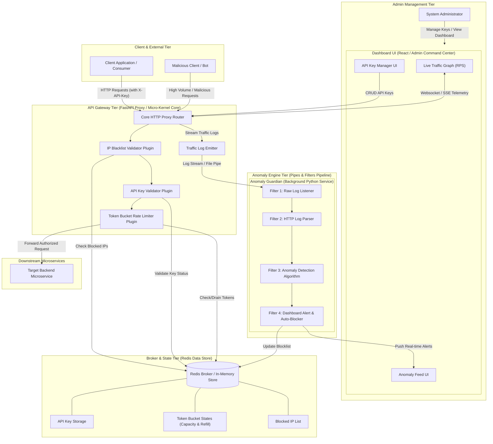
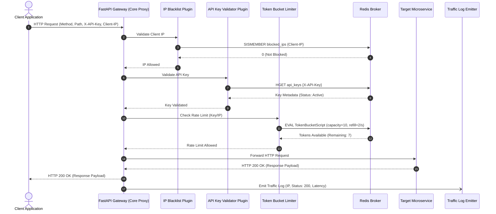
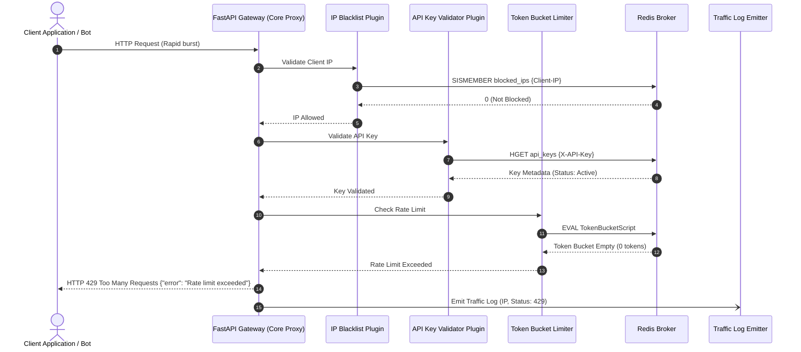
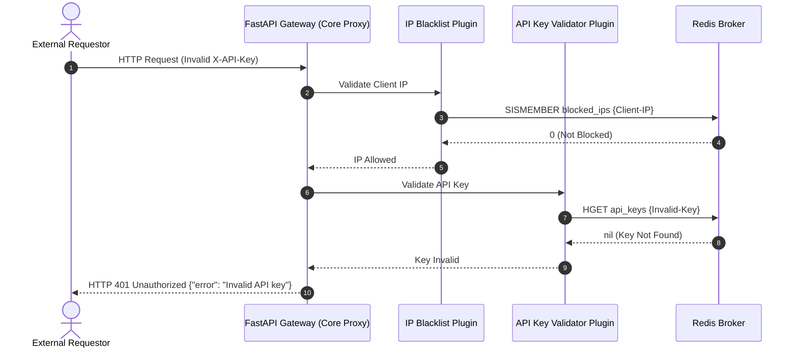
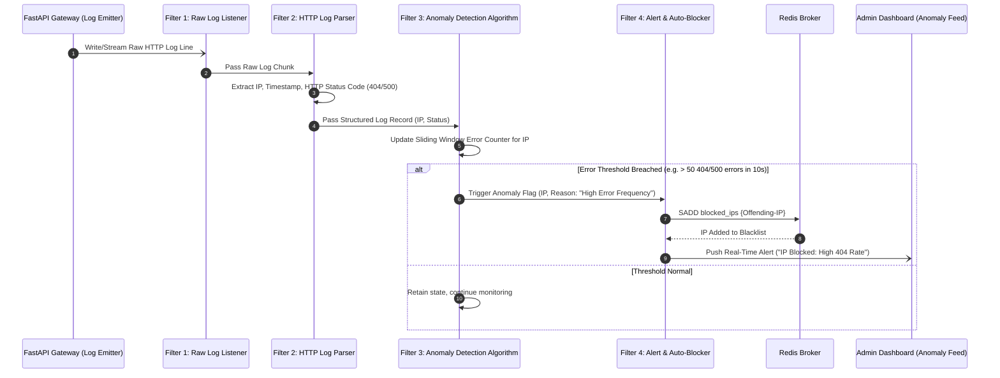
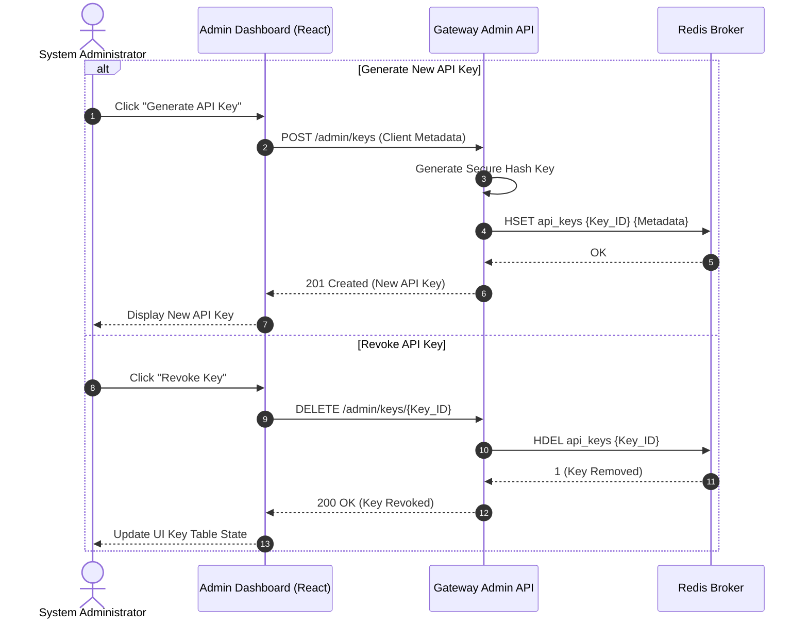

# ShieldAPI - Component & Sequence Diagrams (Initial Prototype)

This document contains detailed **UML Component** and **Sequence Diagrams** for the initial prototype of **ShieldAPI**, created according to the project specifications.

---

## Architectural Patterns Summary

ShieldAPI incorporates three core architectural styles:
1. **Broker Pattern**: Uses Redis as an in-memory message broker/state store to track API tokens, manage rate limits, and maintain IP blocklists across distributed gateway instances.
2. **Micro-Kernel (Plugin) Pattern**: The central core is a lightweight FastAPI HTTP Proxy. Extensible plugins (API Key Validator, Token Bucket Rate Limiter, IP Blacklist Validator) attach to the core proxy execution lifecycle.
3. **Pipes and Filters Pattern**: The Anomaly Guardian background service processes logs sequentially:
   `Raw HTTP Logs (Filter 1)` $\rightarrow$ `Log Data Parser (Filter 2)` $\rightarrow$ `Anomaly Detection Algorithm (Filter 3)` $\rightarrow$ `Dashboard Alert & Auto-Blocker (Filter 4)`.

---

## 1. System Component Diagram

The component diagram details the internal modules, plugins, data stores, and interfaces for the ShieldAPI ecosystem.

---

## 2. Sequence Diagrams

### 2.1 HTTP Request Lifecycle (Normal Authorized Request)

This diagram details the successful processing flow of an incoming client request passing through the IP blacklist check, API key validation, and token bucket rate limiter before reaching the downstream target microservice.

---

### 2.2 Rate Limited Request Flow (HTTP 429 Too Many Requests)

When a client exceeds their permitted request rate, the Token Bucket Limiter plugin detects an empty token bucket and immediately drops the request with HTTP 429.

---

### 2.3 Invalid API Key Request Flow (HTTP 401 Unauthorized)

If an invalid or missing API key is provided, the API Key Validator plugin halts execution early.

---

### 2.4 Anomaly Guardian Processing Pipeline (Pipes & Filters)

This sequence maps how background traffic logs are processed sequentially by the Anomaly Guardian pipeline to detect abuse (excessive 404/500 errors) and auto-block offending IPs.

---

### 2.5 Admin API Key Management Flow

This sequence demonstrates how a system administrator interacts with the Admin Dashboard UI to generate or revoke API keys stored in Redis.

