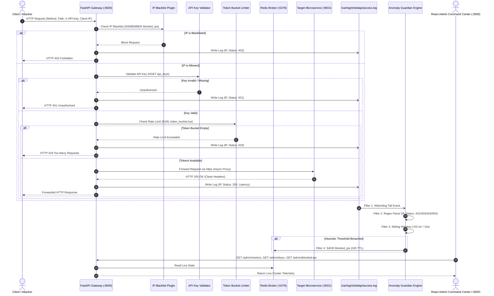

# ShieldAPI - Final Project Handover & Docker Auto-Testing Guide

This document captures the complete architectural state of **ShieldAPI** and provides a step-by-step testing guide for the next developer/evaluator running final automated verification on **Docker**.

---

## 1. 🏗️ Summary of All Completed Work

The entire ShieldAPI platform is **100% implemented, integrated, and verified**.

### Summary of Modules:

| Application / Package | Technology | Status | Key Responsibilities |
| :--- | :--- | :--- | :--- |
| **`packages/shared`** | Python / Redis / Lua | ✅ Complete | • `RedisManager`: Manages Token Bucket, IP blacklisting with 24h TTL, and API keys.<br>• `token_bucket.lua`: Atomic in-memory rate-limiting script. |
| **`apps/gateway`** | Python / FastAPI / HTTPX | ✅ Complete | • **Micro-Kernel Reverse Proxy** on port `8000`.<br>• **Plugins**: `IPBlacklistPlugin` (403), `ApiKeyValidatorPlugin` (401), `RateLimiterPlugin` (429).<br>• **Async Logger**: Appends to `/var/log/shieldapi/access.log`.<br>• **Admin API**: REST endpoints for metrics, keys, and blocklist. |
| **`apps/anomaly-engine`** | Python / Pipes & Filters | ✅ Complete | • Background service monitoring `/var/log/shieldapi/access.log`.<br>• Regex parser capturing 401, 403, 404, 500 error bursts.<br>• 10-second sliding window counter.<br>• **Auto-Blocker**: Executes `RedisManager.block_ip(ip, 86400)` when errors exceed 50 in 10s. |
| **`apps/backend-service`** | Python / FastAPI | ✅ Complete | • Protected downstream target microservice on port `8001`.<br>• Serves `/health`, `/api/v1/target`, `/api/v1/payments`, `/api/v1/users/profile`, `/api/v1/auth/verify`, `/api/v1/events`. |
| **`apps/dashboard`** | React 18 / Vite / Tailwind | ✅ Complete | • **Admin Command Center** on port `3000`.<br>• 8 Views: Command Center, Services, Key Vault, Token Bucket Visualizer, Anomaly Guardian Threat Center, Access Logs, Topology Health, Settings & Sim.<br>• Connected to Gateway Admin REST API. |
| **`docker-compose.yml`** | Docker Compose v3.8 | ✅ Complete | • Orchestrates `redis` (6379), `gateway` (8000), `anomaly-engine`, `backend-service` (8001), `dashboard` (3000), and shared volumes (`shared_logs`, `redis_data`). |

---

## 2. 🔄 End-to-End System Architecture & Data Flow



---

## 3. 🧪 Step-by-Step Final Automated Testing Guide (For Teammates)

Follow these steps to run the complete automated test suite on Docker:

### Step 1: Pull the Latest Code
```bash
git pull origin main
```

### Step 2: Build & Start All Docker Containers
Start all 5 services (Redis, Gateway, Anomaly Engine, Backend Microservice, Dashboard):
```bash
docker-compose up --build
```
*Verify that all containers start cleanly:*
- `shieldapi-redis` (port 6379)
- `shieldapi-gateway` (port 8000)
- `shieldapi-backend-service` (port 8001)
- `shieldapi-anomaly-engine` (background)
- `shieldapi-dashboard` (port 3000)

---

### Step 3: Run the Automated End-to-End Test Suite
In a new terminal window, execute the automated test runner:
```bash
python test_e2e_integration.py
```

#### What `test_e2e_integration.py` Automatically Tests:
1. **Test 1: Health & Redis Connectivity**: Verifies Gateway on port 8000 and Redis ping response.
2. **Test 2: API Key Authentication Plugin**:
   - Sends request without `X-API-Key` $\rightarrow$ Asserts `HTTP 401 Unauthorized`.
   - Sends request with invalid `X-API-Key` $\rightarrow$ Asserts `HTTP 401 Unauthorized`.
   - Sends request with valid key `test_key_123` $\rightarrow$ Asserts `HTTP 200 OK` and inspects downstream JSON payload.
3. **Test 3: Token Bucket Rate Limiting (`token_bucket.lua`)**:
   - Provisions a custom test key with capacity=4, refill=1.0/s.
   - Sends 6 rapid requests $\rightarrow$ Asserts exactly 4 requests return `200 OK` and 2 requests return `429 Too Many Requests`.
4. **Test 4: Anomaly Guardian Auto-Blocking (Pipes & Filters)**:
   - Fires 55 rapid 404 error requests to breach the heuristic threshold (>50 errors in 10s).
   - Waits 2.5 seconds for Watchdog & Filter 4 to execute `RedisManager.block_ip(ip, 86400)`.
   - Verifies the client IP is listed in `/admin/blocked-ips`.
   - Sends a request from the same IP $\rightarrow$ Asserts Gateway immediately drops it with `HTTP 403 Forbidden`.
   - Automatically unblocks the IP via the Admin API.
5. **Test 5: Admin Telemetry & Metrics API**:
   - Queries `GET /admin/metrics` to verify live Redis memory usage, ops/sec, and cluster health.

---

### Step 4: Run the Redis Manager Unit Test
To verify raw Redis operations against the running container:
```bash
python test_redis_manager.py
```
*Asserts API Key generation/revocation, Token Bucket drain/refill, and IP TTL expiration.*

---

### Step 5: Open & Verify the Web Dashboard
Open your browser and navigate to:
```
http://localhost:3000
```
- **Overview (Command Center)**: View live request throughput (RPS), avg latency, and multi-area traffic distribution.
- **API Services**: Inspect registered endpoints and live latencies.
- **API Keys**: Click "+ Generate Key" to provision a new key directly into Redis.
- **Rate Limits**: Click "Burst 5" or "Flood 12" to see the in-memory token bucket drain and refill in real-time.
- **Anomaly Center**: Click "Simulate 404 Attack Burst" to witness live auto-blacklisting and 24h TTL countdowns.
- **Traffic Logs**: Inspect live `/var/log/shieldapi/access.log` entries and open the Forensic Request Drawer.
- **System Health**: View the live cluster topology diagram (Client $\rightarrow$ Gateway $\rightarrow$ Redis $\rightarrow$ Microservice).

---

## 4. 📂 Key Files Reference

- **Gateway Main App**: [`apps/gateway/app/main.py`](file:///c:/Users/Zaids/Desktop/shieldApi-main/apps/gateway/app/main.py)
- **Proxy Router & Plugins**: [`apps/gateway/app/router.py`](file:///c:/Users/Zaids/Desktop/shieldApi-main/apps/gateway/app/router.py), [`apps/gateway/app/plugins/`](file:///c:/Users/Zaids/Desktop/shieldApi-main/apps/gateway/app/plugins)
- **Shared Redis Logic**: [`packages/shared/redis_manager.py`](file:///c:/Users/Zaids/Desktop/shieldApi-main/packages/shared/redis_manager.py), [`packages/shared/token_bucket.lua`](file:///c:/Users/Zaids/Desktop/shieldApi-main/packages/shared/token_bucket.lua)
- **Anomaly Guardian Pipeline**: [`apps/anomaly-engine/engine/main.py`](file:///c:/Users/Zaids/Desktop/shieldApi-main/apps/anomaly-engine/engine/main.py)
- **Downstream Microservice**: [`apps/backend-service/app/main.py`](file:///c:/Users/Zaids/Desktop/shieldApi-main/apps/backend-service/app/main.py)
- **React UI Command Center**: [`apps/dashboard/src/`](file:///c:/Users/Zaids/Desktop/shieldApi-main/apps/dashboard/src)
- **Automated Integration Test**: [`test_e2e_integration.py`](file:///c:/Users/Zaids/Desktop/shieldApi-main/test_e2e_integration.py)
